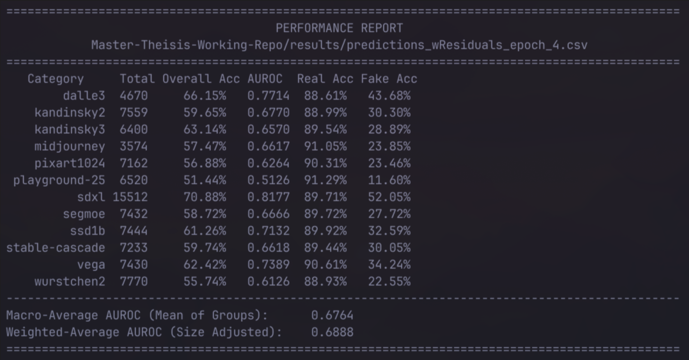

# FakeInversion-single-image-script
This is a script to get a prediction for a single image using my implementaiton of the fakeinversion model.
The script loades an image as a base64 string because that is the input for a competition it might be used in.

Result for the two models on SynRIS:

